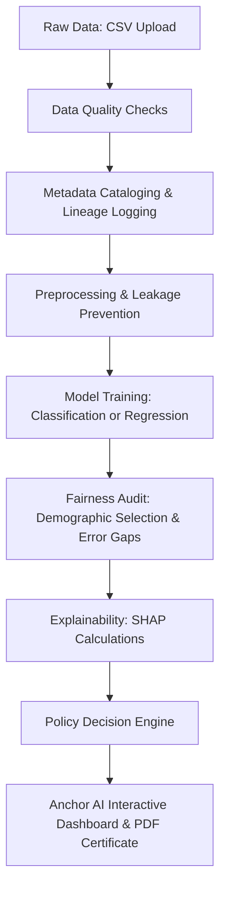

# Anchor AI — General-Purpose AutoML & Governance Platform

Welcome to **Anchor AI**, an enterprise-grade automated machine learning validation and model governance platform. This platform allows users to upload custom datasets, automatically preprocess them without data leakage, train predictive models, audit model safety/fairness, explain predictions, and generate a PDF compliance certificate.

Anchor AI supports **binary classification**, **multiclass classification**, and **regression** tasks out-of-the-box. It features an ultra-premium, dark-mode, glassmorphism dashboard powered by Streamlit, complete with a live **Risk Sandbox** and **interactive threshold simulators**.

---

## 🏗️ Architecture & Pipeline Flow

Anchor AI operates as a sequential pipeline, where each stage depends on safety audits and outputs lineage data:



---

## 📦 Core Platform Components

The system is structured as modular components located in the `src/` directory:

### 1. Data Ingestion & Quality Audit (`ingest.py` & `data_quality.py`)
* Checks raw data for missing values, duplicates, and column completeness.
* Generates a quality score. If dataset quality drops below threshold, the pipeline alerts the operator.

### 2. Metadata Catalog & Lineage Tracker (`metadata_manager.py` & `lineage_tracker.py`)
* Extracts metadata schemas (datatypes, categories, value ranges, and counts).
* Records chronological process logs to guarantee traceability of every training run (Lineage).

### 3. Preprocessing & Scaler (`preprocess.py`)
* Implements robust data splitting before encoding or scaling to prevent data leakage.
* Standardizes numeric scales with a `StandardScaler`.
* Transforms categorical columns into aligned dummy features using strict validation categories.

### 4. Training & Model Objects (`train_model.py`)
* Automatically detects the prediction task or allows manual override.
* Trains **Logistic Regression / Random Forest Classifier** for classification and **Ridge CV / Random Forest Regressor** for regression tasks.
* Saves model metrics (Accuracy/Recall or $R^2$/MAE/RMSE) to JSON reports and serializes weights to dynamic model scripts in `models/`.

### 5. Demographic Fairness Audit (`fairness_checks.py`)
* Audits predictive discrepancies across user-specified demographic columns.
* Computes selection rate and recall gaps for classification; computes MAE and prediction gaps for regression.

### 6. SHAP Explainability Engine (`explainability.py`)
* Utilizes SHAP (SHapley Additive exPlanations) values to calculate global feature importances.
* Saves feature rankings and renders visual charts (`shap_summary.png`).

### 7. Policy Gatekeeper (`policy_engine.py`)
* Acts as the final sign-off gate. Evaluates performance and bias gaps against configurable compliance rules.
* Yields the final status: `APPROVED`, `CONDITIONALLY APPROVED` (passed performance but failed fairness), or `REJECTED`.

---

## 🔮 The Interactive Prediction Sandbox

The centerpiece of Anchor AI is the **Risk Sandbox** page in the dashboard, designed to give engineers and compliance stakeholders hands-on simulation tools:

### Tab 1: 🔮 Interactive Predictor
* **Dynamic Widget Generation:** Organizes sliders bounded by min/max values for numeric features and dropdowns populated with unique category values for categorical features.
* **Explanation Panel (Local Drivers):** Aggregates dummy features back into original features to show correct contribution levels relative to baseline predictions.

### Tab 2: 🎛️ Threshold & Policy Simulator
* **Decision Threshold Slider:** Slide the decision threshold (0.05 to 0.95) to shift classification boundaries and model bias.
* **Compliance Limit Sliders:** Adjust limits for performance and fairness metrics to see live scorecard updates.

---

## 💻 Tech Stack & Dependencies

* **Language:** Python 3.9+
* **UI/Visuals:** Streamlit (with Outfit and Inter fonts, glassmorphism CSS styling, and SVG iconography)
* **Science & ML:** Pandas, NumPy, Scikit-learn
* **Explainability:** SHAP
* **Visualization:** Matplotlib
* **Reporting:** ReportLab (PDF compliance certificate generation)

---

## 📁 Directory Structure

```text
governance_project/
├── data/
│   ├── raw/                  # Contains raw CSV datasets
│   └── processed/            # Preprocessed train/test partitions
├── models/
│   ├── logistic_model.py     # Serialized/templated Linear Model Script
│   ├── random_forest.py      # Serialized/templated Forest Model Script
│   └── scaler.py             # Preprocessing Scaler Script
├── reports/                  # Pipeline json results & SHAP png
├── metadata/                 # Lineage log & dataset catalog JSONs
├── src/                      # Source scripts
│   ├── auto_pipeline.py      # Core AutoML pipeline orchestration
│   ├── ingest.py
│   ├── data_quality.py
│   ├── metadata_manager.py
│   ├── preprocess.py
│   ├── train_model.py
│   ├── fairness_checks.py
│   ├── explainability.py
│   ├── policy_engine.py
│   ├── pdf_generator.py      # Compliance PDF Certificate Generator
│   └── utils.py
├── dashboard/
│   └── app.py                # Streamlit Web Application
├── main.py                   # Orchestrates the CLI backend pipeline
└── README.md                 # Project Documentation
```

---

## 🚀 Setup & Execution Guide

### 1. Environment Installation
Ensure you are in the project folder, then instantiate a virtual environment and install requirements:
```bash
# Create and activate virtual environment
python3 -m venv .venv
source .venv/bin/activate

# Install dependencies
pip install -r requirements.txt
```

### 2. Running the ML Pipeline (CLI)
You can run the pipeline on any custom CSV dataset from the command line:
```bash
python3 main.py --file data/raw/Customer-Churn.csv --target Churn --demographic gender
```
* **Arguments:**
  * `--file`: Filename or absolute path to CSV dataset.
  * `--target`: Target column name to predict (defaults to last column).
  * `--demographic`: Protected demographic column to audit (auto-detected by keyword if unspecified).
  * `--task_type`: Override prediction task (`classification` or `regression`).
  * `--positive_class`: Positive class label (for binary classification).

### 3. Launching the Interactive Dashboard
To launch the high-end Streamlit web dashboard:
```bash
streamlit run dashboard/app.py
```
Once started, navigate to **`http://localhost:8501`** in your browser. Upload any CSV file or load the Customer Churn demo directly from the landing page.

---

## 👤 Author & Support

* **Rohan Mahendra**
* MS Engineering Management, Johns Hopkins University